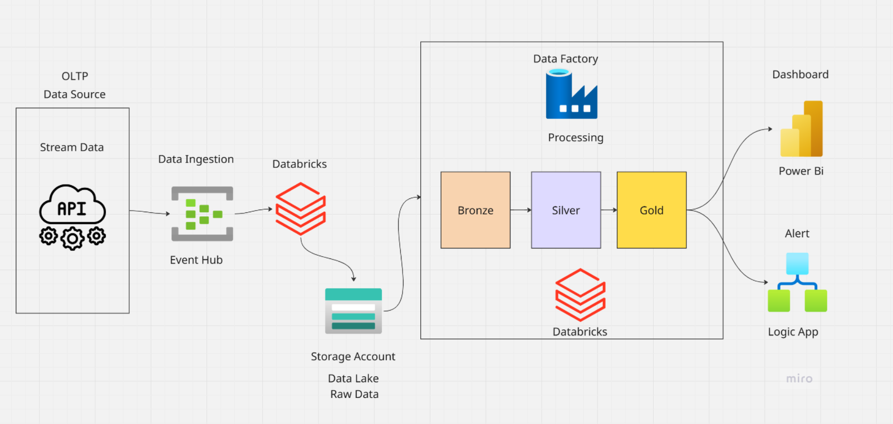
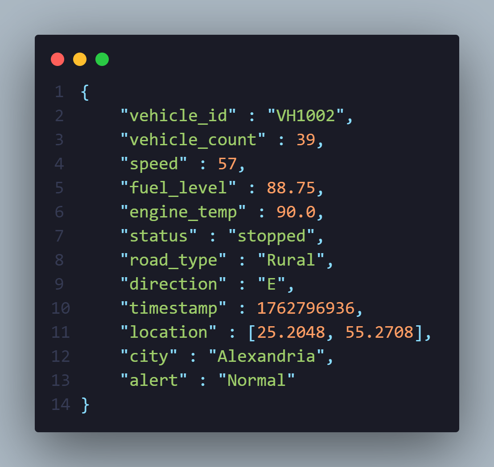
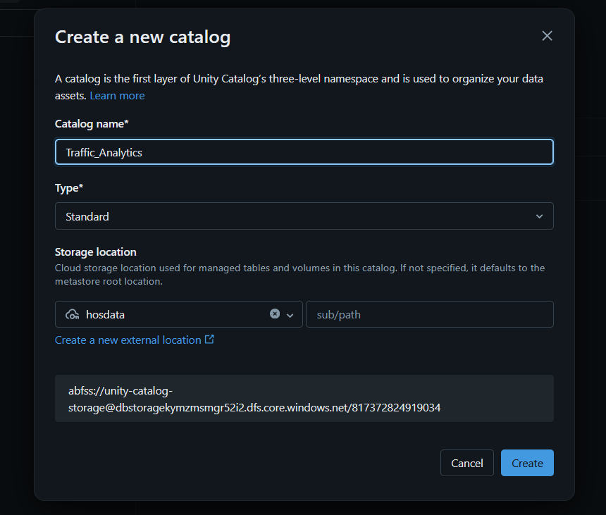
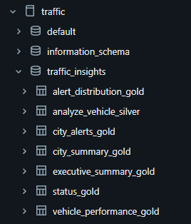
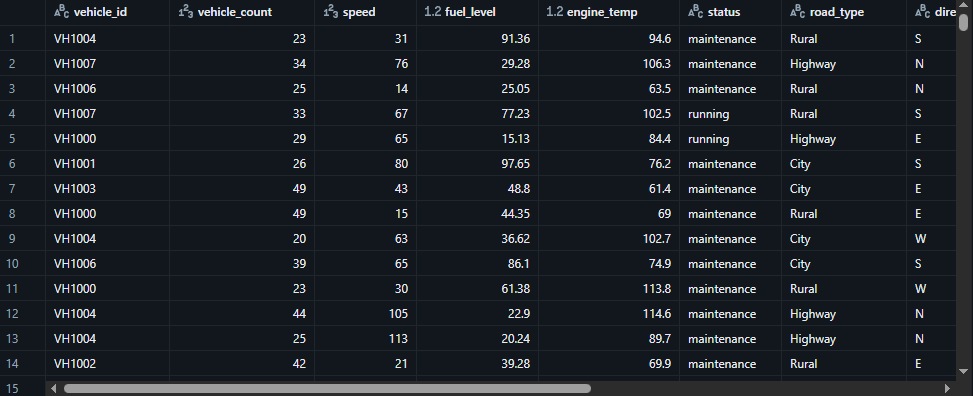
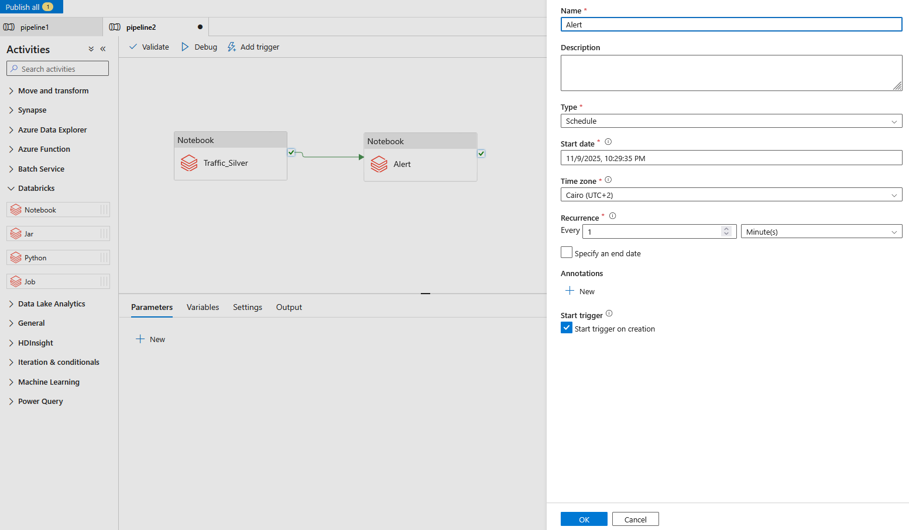
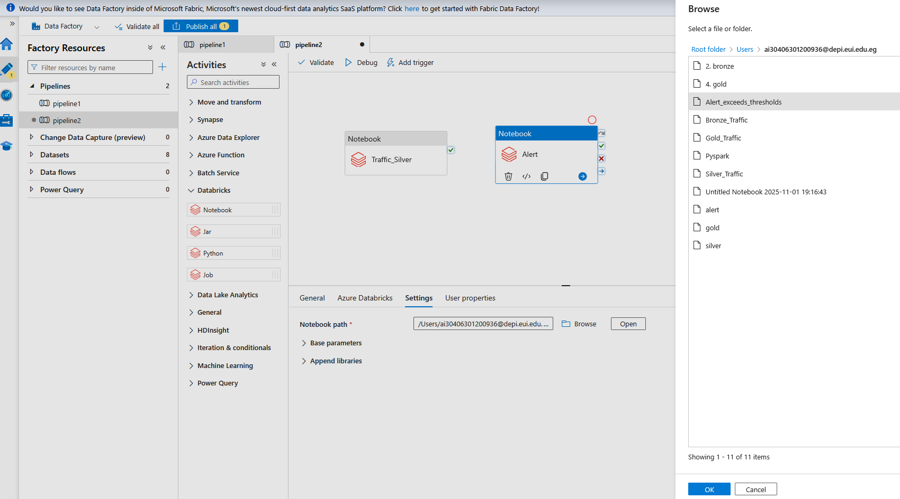
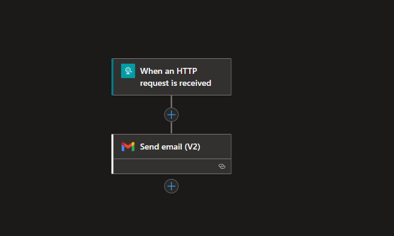
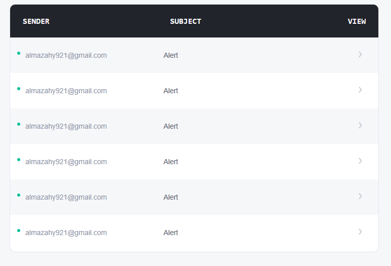
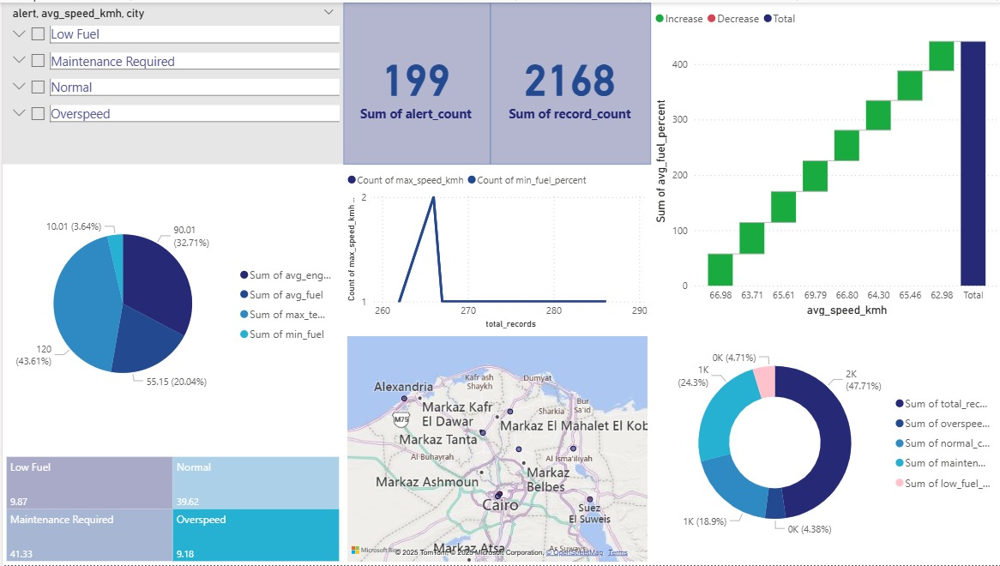

# 🚦 End-to-End Real-Time Traffic Analytics & Alerting System (Azure + Power BI)

A comprehensive data engineering and analytics project that demonstrates a modern, scalable data pipeline using **Microsoft Azure** services. This system simulates real-time traffic data, processes it through a **Medallion Architecture**, automates critical safety alerts, and serves actionable insights via an interactive **Power BI** dashboard.

---

## 🛠️ Tools & Technologies

| Category | Tool / Technology | Purpose |
| :--- | :--- | :--- |
| **Data Source (Simulation)** | Python Producer Script | Simulates IoT/Vehicle Sensor Data |
| **Data Ingestion** | Azure Event Hubs | Real-time streaming and high-throughput capture |
| **Data Storage** | Azure Data Lake Storage Gen2 (ADLS) / Blob Storage | Scalable, tiered storage for Bronze, Silver, & Gold layers |
| **Data Processing & Transformation** | Azure Databricks (PySpark, Spark SQL) | Core processing engine for Medallion transformation |
| **Orchestration** | Azure Data Factory (ADF) | Schedules and manages batch and alerting pipelines |
| **Real-Time Alerting** | Azure Logic Apps | Automates email notifications based on critical events |
| **Data Visualization** | Microsoft Power BI | Interactive reporting and dashboarding |
| **Data Governance** | Unity Catalog (Databricks) | Manages data assets, security, and lineage |

---

## 🏗️ Technical Architecture & Data Pipeline

The pipeline follows a modern **Medallion Architecture** (Bronze → Silver → Gold) implemented entirely on the Azure Cloud. It handles both **batch historical analysis** and **near real-time alerting**.

### 1. Data Ingestion (Source → Event Hub → Bronze Layer)

The process begins with continuous generation of traffic data simulating vehicle sensors (Speed, Location, Engine Temp, Incident Flags).

* **Data Producer:** A Python script sends continuous JSON events to the cloud.
  
  

  **Raw JSON Data Structure :**

 
  
* **Event Streaming:** Azure Event Hubs captures these high-throughput messages.

  
  
  
* **Raw Storage (Bronze):** The raw JSON data is dumped directly into ADLS Gen2, serving as the immutable historical record.
  
   
   
   
### 2. Data Processing & Transformation (Azure Databricks)

Azure Databricks, utilizing **Delta Lake** and governed by **Unity Catalog**, serves as the core processing engine.

#### Phase A: Bronze to Silver (Cleaning & Standardization)

* **Data Quality:** Casting data types, handling nulls, and removing duplicates.
* **Structure:** Flattening the nested JSON data into structured Delta tables.

#### Phase B: Silver to Gold (Business Aggregation)

* Gold tables are highly aggregated and optimized to directly support reporting requirements in Power BI.
* *Examples:* `executive_summary_gold` (KPIs), `city_summary_gold` (traffic flow).

### 3. Pipeline Orchestration (Azure Data Factory - ADF)

ADF manages the workflow, ensuring Databricks notebooks run in the correct sequence and on schedule for batch transformations (Bronze-to-Silver and Silver-to-Gold).

**ADF Linked Service Creation :**

### 4. Real-Time Alerting System (ADF + Logic Apps)

This system provides a crucial near real-time safety layer, running frequently (e.g., every 1 minute) to detect dangerous incidents.

#### 🚨 Detection and Trigger

1.  **Detection:** ADF triggers a dedicated Databricks Alert notebook.
2.  **Scan:** The notebook scans the latest Silver layer data for critical flags.
3.  **Payload:** If an incident is found, Databricks sends the alert payload to a dedicated **Alert Event Hub**.

#### 📧 Notification

1.  **Listener:** An **Azure Logic App** is configured to listen for new messages on the Alert Event Hub.

   
2.  **Email:** The Logic App sends a formatted HTML alert email to the relevant safety personnel.

---

## 🗄️ Data Model & Insights (Gold Layer)

The Gold layer tables are the definitive source for all analytics and reporting.

| Table Name | Purpose |
| :--- | :--- |
| `executive_summary_gold` | Key Performance Indicators (KPIs) overview for management |
| `city_alerts_gold` | Detail of all alerts categorized by city |
| `city_summary_gold` | Aggregate traffic flow and volume metrics by city |
| `alert_distribution_gold` | Root cause analysis and distribution of alert types |
| `vehicle_performance_gold` | Metrics on individual vehicle behavior |
| `status_gold` | System health and data freshness indicator |

---

## 📈 Power BI Report Overview

The Power BI dashboard provides an interactive and actionable interface:

* **Real-time KPIs** and system status.
* **Incident Geospatial Map** for visualizing the location and severity of accidents.
* **City-level Trends** for analyzing traffic flow and historical incidents.

---

## 🏁 Conclusion

This project successfully builds a robust **Smart Traffic Monitoring System** using Azure Event Hubs, Databricks, ADF, and Logic Apps. It is designed to support **real-time decision-making**, provide **proactive alerts**, and enable **in-depth traffic analytics**.

---

### 👤 Author

<a href= 'https://github.com/MazenSehsah'/>Mazen Hesham
<a href= 'https://github.com/AhmedAwad231'/>Ahmed Awad
<a href= 'https://github.com/AleyMohammed'/>Ali Mohamed
<a href= 'https://github.com/abdallah-mostafa-Max'/>Abdullah Mostafa
<a href= 'https://github.com/aya5ashaba-rgb'/>Aya Ali
